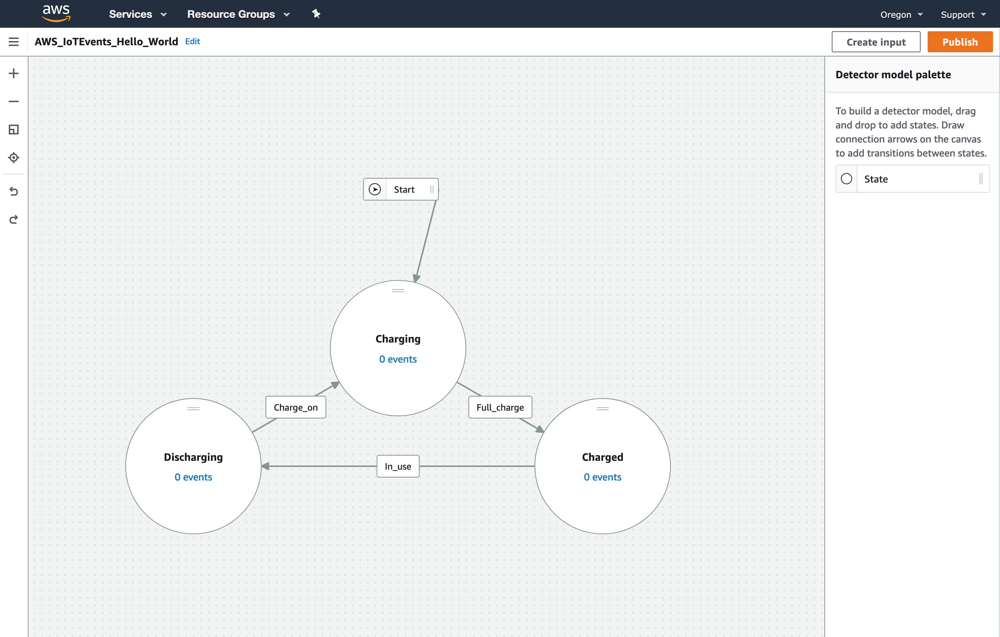
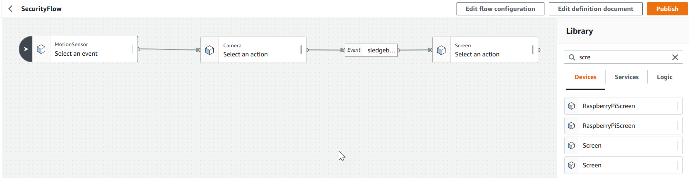

# Diagram Maker

[Diagram Maker](https://awslabs.github.io/diagram-maker) is a library to display an interactive editor for any graph-like data.

Following is a screenshot from one of the consumers of this library, [AWS IoT Events Console](https://console.aws.amazon.com/iotevents/home?region=us-east-1#/create/detectormodel) with Diagram Maker in action.

Following is a screenshot from another one of the consumers of this library, [AWS IoT Things Graph Console](https://console.aws.amazon.com/thingsgraph/home?region=us-east-1#/flows/create) with Diagram Maker in action.

## Why Diagram Maker?
Diagram Maker is a framework & data format agnostic library that is fully customizable in terms of look & feel as well as behavior. It also exposes a declarative interface to reduce the code required to integrate the library in any application and comes with many interactive features built in. Read more about the features of the library [here](https://awslabs.github.io/diagram-maker/?path=/story/docs-features--page).

## Explore

### Interactive Demo
Check out one of our interactive demos [here](https://awslabs.github.io/diagram-maker/?path=/story/demos-diagram-maker--left-right-rectangular) or see the full list of interactive demos [here](https://awslabs.github.io/diagram-maker/?path=/story/docs-explore-demos--page). The code for these demos can be found [here](https://github.com/awslabs/diagram-maker/tree/master/integ/demos.stories.ts).

### Plugins
Check out the plugins that can be used alongside the library for additional functionality [here](https://awslabs.github.io/diagram-maker/?path=/story/docs-explore-plugins--page).

### Showcase
Check out some of the consumers of this library [here](https://awslabs.github.io/diagram-maker/?path=/story/docs-explore-showcase--page).

## How do I use it?

### Installation
Check out our installation guide [here](https://awslabs.github.io/diagram-maker/?path=/story/docs-getting-started-installation--page).

### Usage
Check out our usage guide [here](https://awslabs.github.io/diagram-maker/?path=/story/docs-usage-initialization--page).

### Architecture
Read more about the architecture of diagram maker [here](https://awslabs.github.io/diagram-maker/?path=/story/docs-usage-architecture--page).

## Docs
Check out our full documentation [here](https://awslabs.github.io/diagram-maker).

## Typedoc generated documentation
Check out the [typedoc](http://typedoc.org/) generated documentation [here](https://awslabs.github.io/diagram-maker/typedoc/modules.html) to find out more information about any of our exported symbols.

## Security

See [CONTRIBUTING](CONTRIBUTING.md#security-issue-notifications) for more information.

## License

This project is licensed under the Apache-2.0 License.

